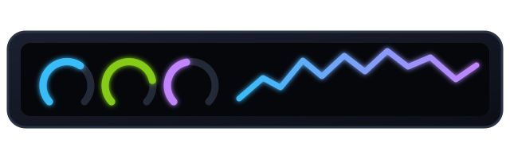
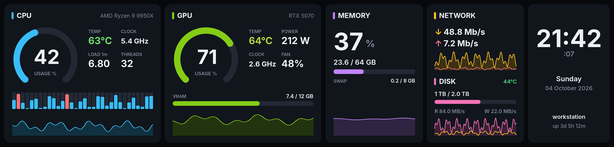
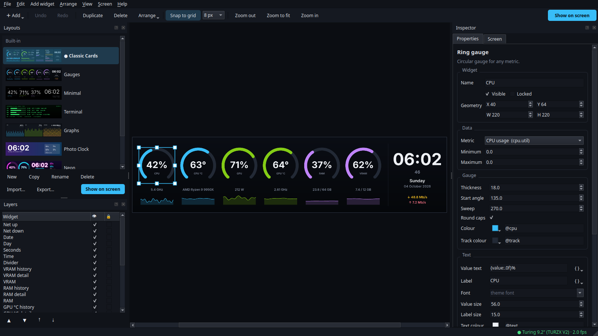
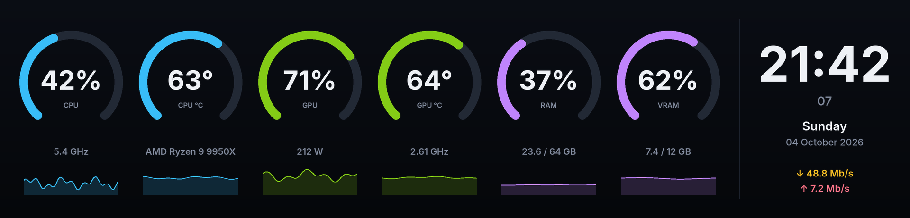
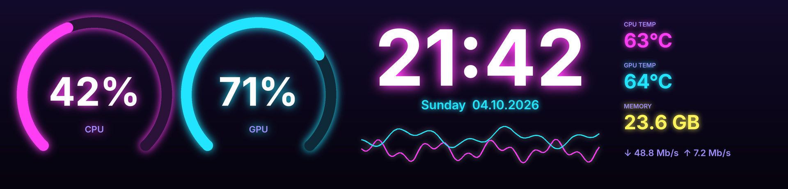
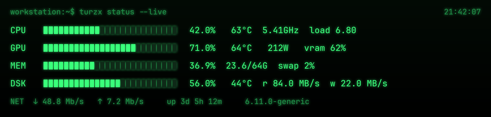
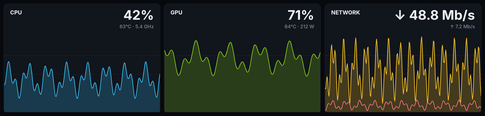
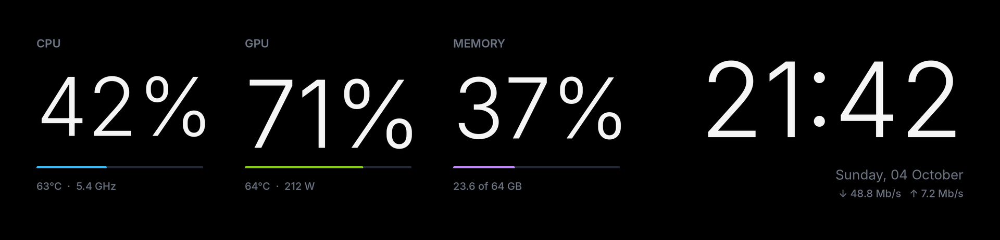
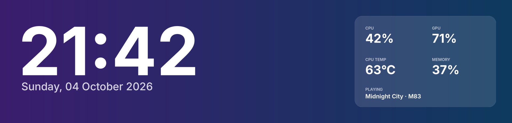
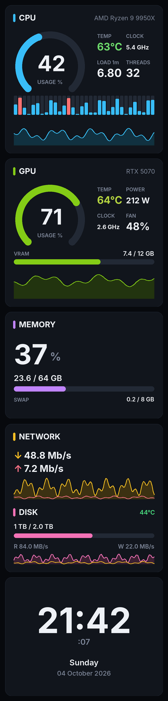

<div align="center">



# turzx-linux


<a href="https://github.com/sjcsoftware/turzx-linux/actions/workflows/ci.yml"></a>


---

Linux driver, background service and drag-and-drop editor<br>
for **TURZX / Turing smart screens**. The vendor only supports Windows.

Built on the protocol work of [turing-smart-screen-python](https://github.com/mathoudebine/turing-smart-screen-python) by [@mathoudebine](https://github.com/mathoudebine).

</div>



> [!WARNING]
> This project is not affiliated, associated, authorized, endorsed by, or in any way officially connected with Turing / XuanFang / Kipye brands, or any of theirs subsidiaries, affiliates, manufacturers or sellers of their products. All product and company names are the registered trademarks of their original owners.
>
> This project is an open-source alternative software, NOT the original software provided for the smart screens. Please do not open issues for USBMonitor.exe/ExtendScreen.exe or for the smart screens hardware here.
>
> - for Turing Smart Screen, use the official forum here: http://discuz.turzx.com/
> - for other smart screens, contact your reseller

## Contents

- [Install](#install)
- [TURZX Studio](#turzx-studio)
- [Built-in layouts](#built-in-layouts)
- [Background service](#background-service)
- [Command line](#command-line)
- [Hardware](#hardware)
- [Troubleshooting](#troubleshooting)
- [Contributing](#contributing)

## Install

```bash
sudo apt install python3-venv libusb-1.0-0     # Debian/Ubuntu
git clone https://github.com/sjcsoftware/turzx-linux.git
cd turzx-linux && ./scripts/install.sh
```

That installs the `turzx` command, **TURZX Studio** in your app menu, the udev rule (asks for sudo once) and the
background service. Your screen lights up right away.

Uninstall with `./scripts/uninstall.sh` (`--purge` also deletes your layouts).

## TURZX Studio



Run `turzx gui` or open **TURZX Studio** from your apps.

- **Drag, resize, snap.** The screen mirrors your edits live.
- **13 widgets:** shape, text, clock, stat, ring gauge, bar, graph, CPU threads, image/GIF, shell command, analog clock,
  screen mirror, system cards.
- **About 40 live metrics:** CPU, GPU (NVIDIA/AMD), RAM, disk, network, battery, now playing.
- **Live text:** `{cpu.temp:.0f}°C`, `{net.down|rate}`, `{time:%H:%M}`. See [all widgets and metrics](docs/widgets.md).
- **Palette colours** (`@cpu`, `@accent`) let you recolour a whole layout at once.
- **Undo/redo**, copy/paste between layouts, and `.json` import/export for sharing.

## Built-in layouts

Edit any of them; Studio saves your changes as a copy.

| | |
|---|---|
| **Classic Cards**  | **Gauges**  |
| **Neon**  | **Terminal**  |
| **Graphs**  | **Minimal**  |
| **Photo Clock** (add your own photo)  | **Classic Cards, portrait** <br> |

## Background service

The installer sets up a **systemd user service**. It starts at login, starts when you plug the screen in,
and survives unplugging and suspend.

```bash
systemctl --user status turzx       # or: turzx service status
systemctl --user restart turzx
journalctl --user -u turzx -f       # logs
turzx service install | uninstall   # enable/disable autostart
```

## Command line

| Command | Does |
|---|---|
| `turzx gui` | Open TURZX Studio |
| `turzx layouts` / `turzx use neon` | List layouts / switch the screen |
| `turzx brightness 40` | Backlight 0-100 |
| `turzx show photo.jpg` | Show an image |
| `turzx video clip.mp4 --loop` | Play a video (needs ffmpeg) |
| `turzx mirror --region 0,0,1920,462` | Mirror part of your desktop (X11) |
| `turzx render gauges out.png` | Render a layout to a file |
| `turzx info` / `turzx test-pattern` | Device info / colour bars |
| `turzx off` | Screen off |

## Hardware

| Screen | USB id | Status |
|---|---|---|
| TURZX / Turing **9.2" V2** | `1cbe:0092` | ✅ Verified |
| Turing 8.8" rev 1.x, 8", 5.2", 4.6", 12.3", 2.1"/2.8" round, square models | `1cbe:00xx` | ❔ Untested ([help wanted](#contributing)) |
| Older serial models (`1a86:5722`…) | | Use [turing-smart-screen-python](https://github.com/mathoudebine/turing-smart-screen-python) |

> [!IMPORTANT]
> Connect the screen with a **USB 3.0 cable to a USB 3.0 port**. Over USB 2.0 it doesn't work reliably.

Run `lsusb | grep 1cbe` to see which model you have.

## Troubleshooting

| Problem | Fix |
|---|---|
| Permission denied | Studio → Screen → **Install udev rule**, then replug |
| Factory wallpaper stays on | `turzx service status`, then check the logs |
| Garbage strip at one end | `turzx clear` or `systemctl --user restart turzx` |
| Upside down / sideways | Studio → Screen → Orientation |
| No GPU stats | `nvidia-smi` must work (NVIDIA) |
| Mirror is black | Mirroring needs an X11 session |

How the screen protocol works, including the 9.2" quirks: [docs/protocol.md](docs/protocol.md).

## Contributing

**Got a different TURZX / Turing screen? You can make it work for everyone.** Most models speak the same protocol
and usually need only one line in the model table plus a test photo. See [CONTRIBUTING.md](CONTRIBUTING.md).

Layouts, widgets, sensors and packaging (AUR, deb, Flatpak) are all welcome too.

---

<div align="center">

GPL-3.0-or-later · Builds on [turing-smart-screen-python](https://github.com/mathoudebine/turing-smart-screen-python)
and [bezel](https://github.com/slipalison/bezel) · Not affiliated with Turing / TURZX

</div>
